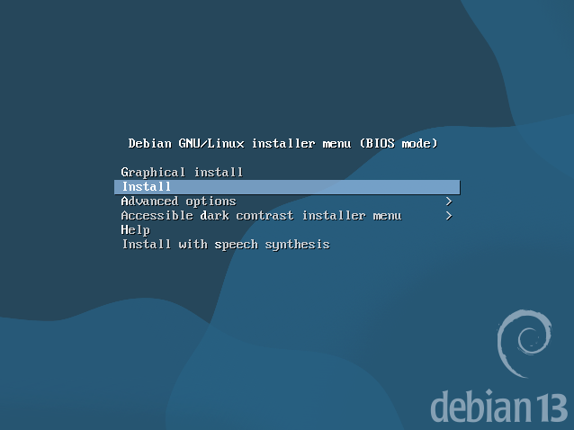
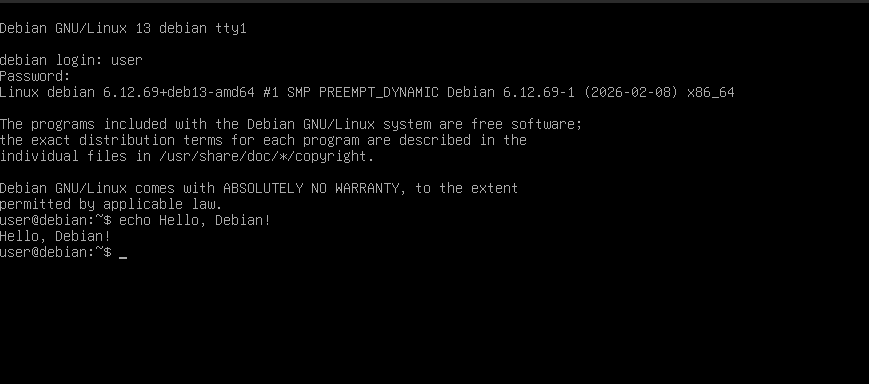
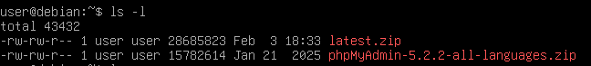
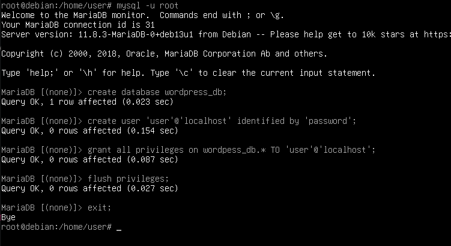
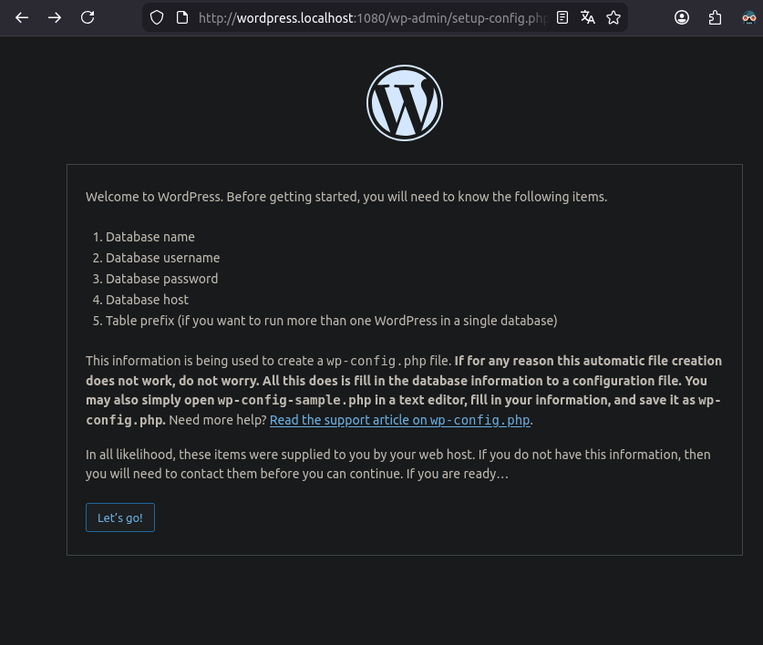
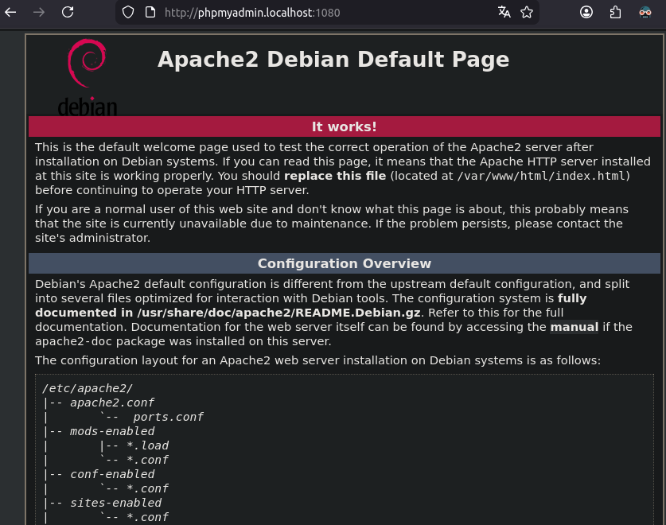
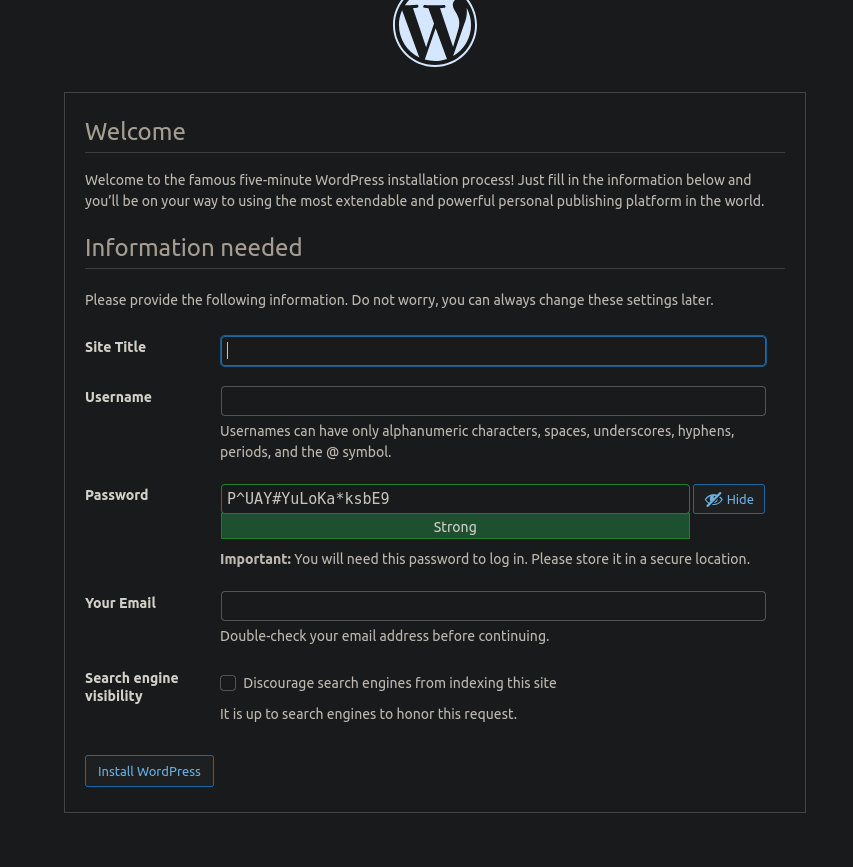

# Лараторная 1. Виртуальный сервер.

## Выполнил: Виктор Анисимов.

## Группа: IA2403

## Дата: 17.02.2026

## Задание: Данная лабораторная работа знакомит с виртуализацией операционных систем (на примере ОС Debian) и настройкой виртуального HTTP сервера (LAMP).

### Создание VM и установка ОС на VM

Утановил qemu.
``` bash
~> qemu-aarch64 --version
qemu-aarch64 version 9.2.4
Copyright (c) 2003-2024 Fabrice Bellard and the QEMU Project developers
```

Скачал и переименовал образ Debian.

Выполнил команду создания образа диска
```bash
~> qemu-img create -f qcow2 debian.qcow2 8G
Formatting 'debian.qcow2', fmt=qcow2 cluster_size=65536 extended_l2=off compression_type=zlib size=8589934592 lazy_refcounts=off refcount_bits=16
```

Выполнил команду:
``` bash
~> qemu-system-x86_64 -hda debian.qcow2 -cdrom dvd/debian.iso -boot d -m 6G
```

Данная команда создаёт виртуальную машину, подключает жёсткий диск(образ диска debian.qcow2) и подключает iso образ Debian.
 - Параметр `-boot d` выполняет загрузку с CD/DVD, тоесть iso образ.
 - Параметр `-m 6G` выделяет 6 гигабайт оперативной памяти виртуальной машине. Выделил больше двух для более быстрой установки.

 После выполнения открывается окно установки ОС Debian.



Выбираю `install`, вместо `Graphic install`.

Выбираю язык - English, моё местоположение - Nigeria, и раскладку - American English.

Настроив хостовои имя - `debian.localhost`, имя пользователя - `user` и пароль пользователя - `password`.

После некоторого ожидания выбрал целый диск для пользоателя - без разделения. Несколько раз подтверждаю свой выбор.

Случайно нажал Enter при выбора основных пакетов, поэтому пришлось выполнить установку заново.

В этот раз использовал команду с другими параметрами для улучшениея харакетирстик VM:

```bash
qemu-system-x86_64         
    -enable-kvm \
    -m 8192 \
    -cpu host \
    -smp 4 \
    -cdrom  ./dvd/debian.iso \
    -drive file=debian.qcow2,if=virtio \ 
    -net nic
    -net user
    -boot d
```

Описание параметров:
- `-enable-kvm` позволяет VM использовать аппаратное ускорение процессора. (нет лишнего слоя эмуляции)
- `-cpu host` VM будет исопльзовать максимально похожый cpu (со фсеми технологиями, библиотеками и т.д.) вместо дополнительного слоя эмуляции безопасной виртуальной модели cpu.  
- `-smp 4` количество выделенных виртуальных процессорных ядер(кол-во потоков).
- `-net nic` создаёт виртуальную сетевую карту карту NIC.
- `-net user` создаёт **user-mode** сеть. 


После полноценной установки запустил VM снова с помощью команды:
```bash
qemu-system-x86_64 
  -hda debian.qcow2 
  -m 6G 
  -smp 2 
  -device e1000,netdev=net0 
  -netdev user,id=net0,hostfwd=tcp::1080-:80,hostfwd=tcp::1022-:22
```
Значение параметров:
 - `-hda` подключает файл, как основной жёсткий диск.
 - `-netdev` пробросаывает порты с хоста к гостю.


### Установка и настройка программ

Выбрав ОС из списка, немного подождав увидел терминал. Залогинился под user и сразу проверил его арботаспособность:



Выполняю команды по установке пакетов:
```bash
su
apt update -y
apt install -y apache2 php libapache2-mod-php php-mysql mariadb-server mariadb-client unzip
```

`su` даёт права суперпользователя,
`apt update -y` обновляет текущие пакет.

Перечислим, какое назначение у текущих пакетов:

 - **apache2** это  HTTP-сервер. принимает запросы из браузера, а возвращает страницы(html,php,файлы)
 - **php** интерпретатор языка PHP.
 - **libapache2**-mod-php пакет для взаимодействия PHP и Apache. 
 - **php-mysql** расширение PHP для возможности подключения к MySQL/MariaDB.
 - **mariadb-server** это сервер СУБД MariaDB.
 - **mariadb-client** это клиентская cli утилита для взаимодействия с бд.
 - **unzip** - распаковщих архивов типа `.zip`

 Все пакеты нацелены на одно: поднятие http-сервера Apache с базой данных MariaDB.


При установки Debian, я оставил поле пароль суперпользователя пустым. Из-за этого сейчас я не смог получить права с помощью команды `su`. \
Испугавшись, что мне прийдётся переустанавливать ОС заного, я узнал, что можно спокойно поменять данный пароль через sudo - что я и сделал (пароль: `1111`).



Распокавал по своим папка по пути `/var/www/`.

Захожу в mysql(mariadb) и создаю:



 - Базу данных
 - Нового пользователя, с ограничением возможности подключится только к локальным БД.
 - Выдаю все права на созданную базу данных новому пользователю.
 - Перезапускаю таблицу прав, для немедленного вступания их в силу.

Создаю конфигурационный файлы `01-phpmyadmin.conf` и `02-wordpress.conf` в папке `/etc/apache2/`.

Разберём конфигурацию:
```bash
<VirtualHost *:80>
    ServerAdmin webmaster@localhost
    DocumentRoot "/var/www/phpmyadmin"
    ServerName phpmyadmin.localhost
    ServerAlias www.phpmyadmin.localhost
    ErrorLog "/var/log/apache2/phpmyadmin.localhost-error.log"
    CustomLog "/var/log/apache2/phpmyadmin.localhost-access.log" common
</VirtualHost>
```

Тег **VirtualHost** обьявляет новый виртуальный хост (для возможности поднятия несколько севреров).
**ServerAdmin** - e-mail администратора
**DocumentRoot** - папка сайта.
**ServerName** - имя сайта.
**ServerAlias** - дополнительные имена
**ErrorLog** - лог файл для ошибок
**CustomLog** - лог запросов к сайту.

Такие же поля устанавливаю и для _wordpress_.

### Запуск и тестирование

Выполнив команду:
```bash
uname -a
```

 

вижу ОС, версию, архитектуру версии.

Для перезапуска Debian Web Server следует выполнить:
```bash
systemctl restart apache2
```

Данная команда выводиться как подсказка после применения конфига сайта.

Оба сайта доступны:
Wordpess:



Phpmyadmin:



Я так же попробовал подключиться к ранее созданной БД на сайте wordpress, но у меня так и не получалось. Оказалось, что у меня почему то небыло прав на созданную БД от созданного пользователя. Я выдал права, и спокойно подключился на сайте к бд.



### Ответы на дополнительные вопросы:

1. Каким образом можно скачать файл в консоли при помощи утилиты wget?

В качестве параметра нужно указать ссылку на файл, тогда он установиться. 

Пример:
```bash
wget https://example.com//file.zip
```

Так же можно скачать в указанное имя файла:
```bash
wget -O other_file.zip https://example.com//file.zip

```

2. Зачем необходимо создавать для каждого сайта свою базу и своего пользователя? 

Это необходимо для разделения данных и настроек - способствует удобству, безопасности, и удобству администрирования.

3. Как поменять доступ к системе управления БД на порт 1234?

В файле конфигурации MariaDB найти
```bash
[mysqld]
port = xxxx # заменить на 1234
```

После следует перезапустить сервис:
```bash
sudo systemctl restart mariadb
```

4. Какие преимущества, с вашей точки зрения, даёт виртуализация?

Возможность иметь несколько независимых ОС на одном hardware.

Удобство использования: удобно создавать, удалять, менять VM - экспереминтировать, или проверять совместимости программ. Это всё никак не ломает основную ОС.

5. Для чего необходимо устанавливать время / временную зону на сервере?

Для коректной работы сервисов, использующих системное время, корректность логов по времени, согласованность работы с клиентами/серверами в других часовых поясах.  

6. Сколько места занимает установленная вами ОС (виртуальный диск) на хостовой машине?

```bash
~> ls -lh
total 2.2G
-rwxr-xr-x 1 victor users 2.2G Feb 18 15:17 debian.qcow2*
drwxr-xr-x 1 victor users    0 Feb 17 16:01 dvd/
drwxr-xr-x 1 victor users 4.0K Feb 18 14:55 images/
-rwxr-xr-x 1 victor users 8.3K Feb 18 14:16 README.md*
```

Виртуальный диск весит 2.2 гигабайта.

7. Какие есть рекомендации по разбиению диска для серверов? Почему рекомендуется так разбивать диск?

Рекомендуется разбивать на следующие тома:
Отдельный под загрущик `/boot`, отдельный под базы данных `/var/lib/mysql`, отдельный под логи, почту.

Такая структура обусловлена в удобстве увеличения размера для нужной части, и безопасности: если логи и почта переполнятся, весь сервер не упадёт.


### Выводы:

В ходе выполнения данной лабораторной работы я ознакомился с созданием виртуального диска, создание VM (через QEMU), установку ОС Debian на виртуальную машину. Так же изучил процесс установки, настройки и подключения Apache, Wordpress, phpMyAdmin и MariaDB. Так же, для удобства пользования, я подключил SSH соединение для управления гостевой ОС с хостовой.